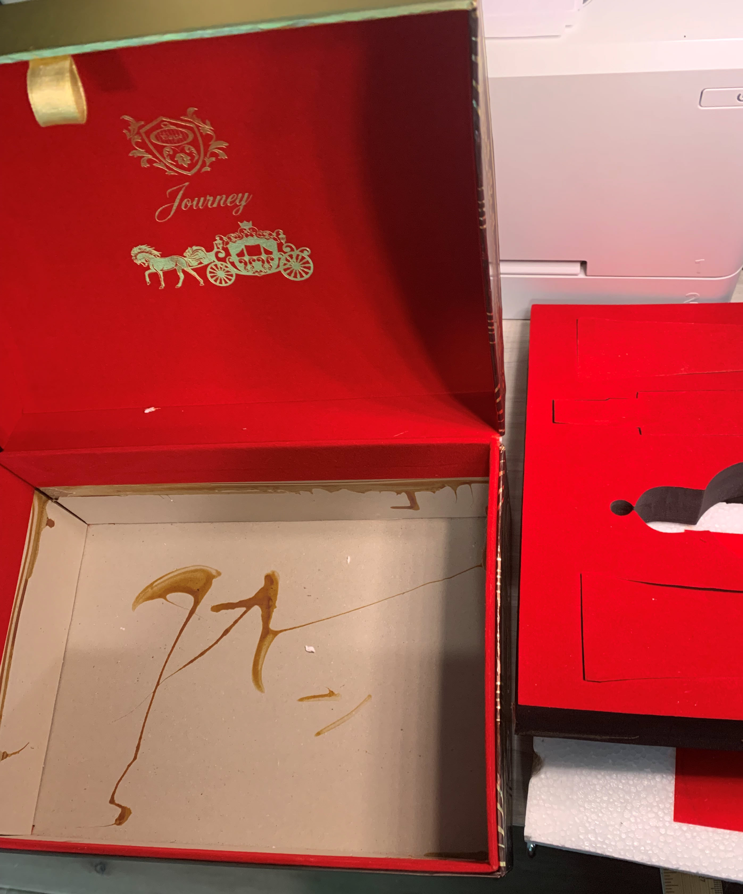
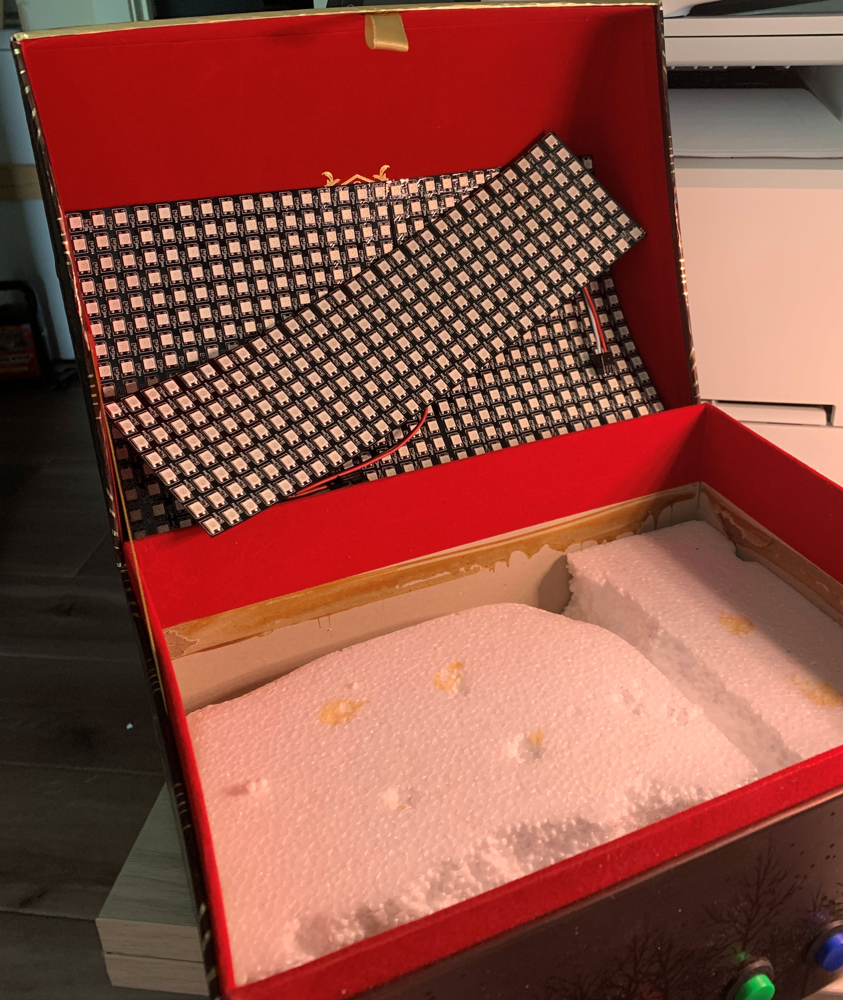
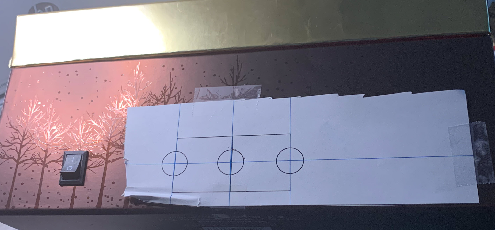
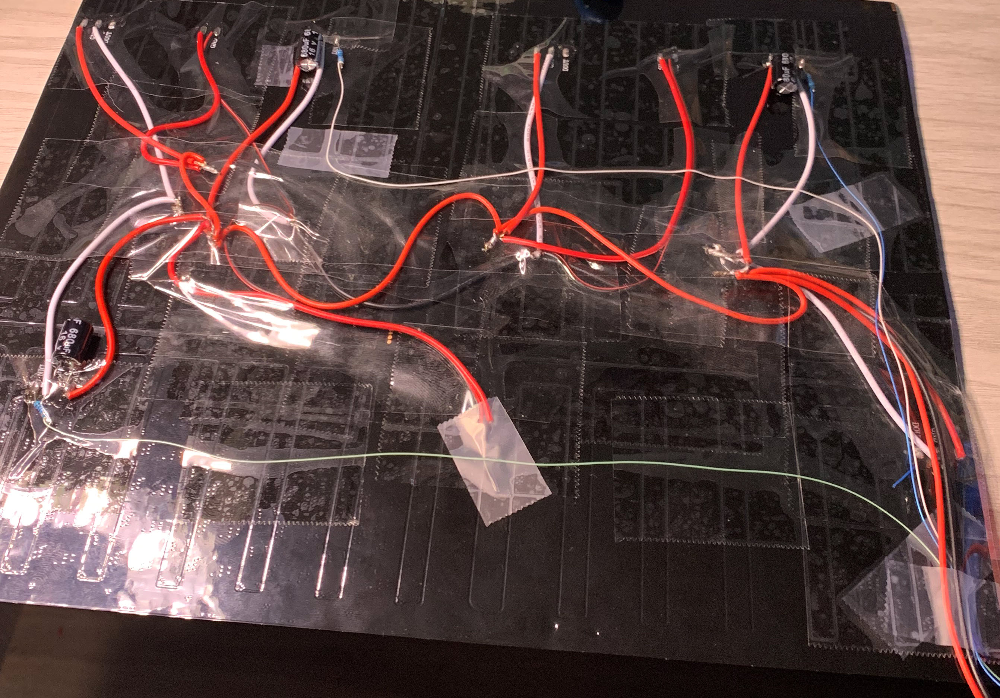
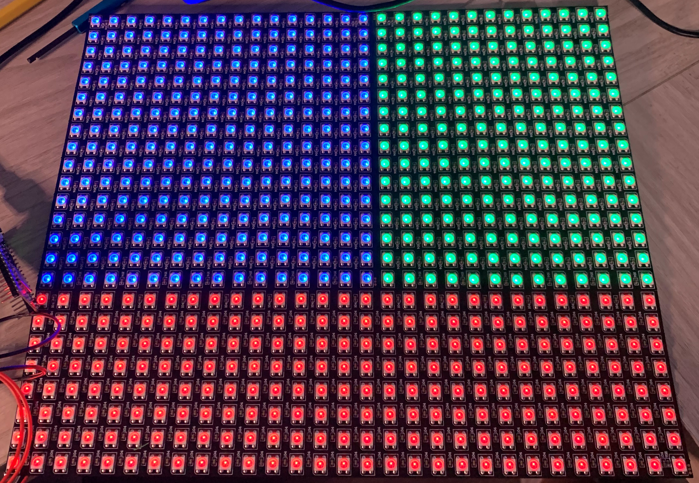
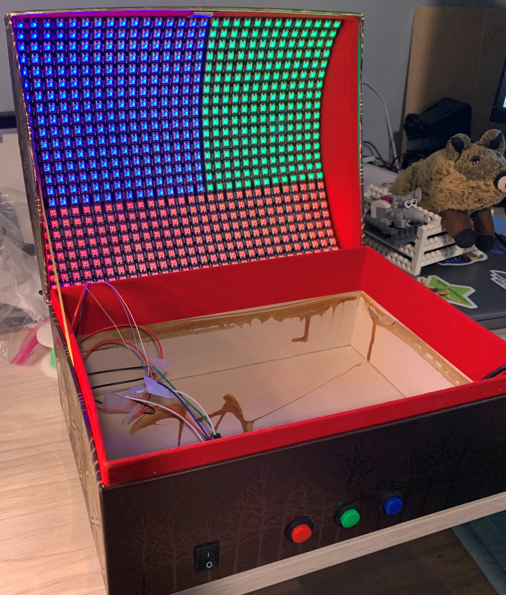
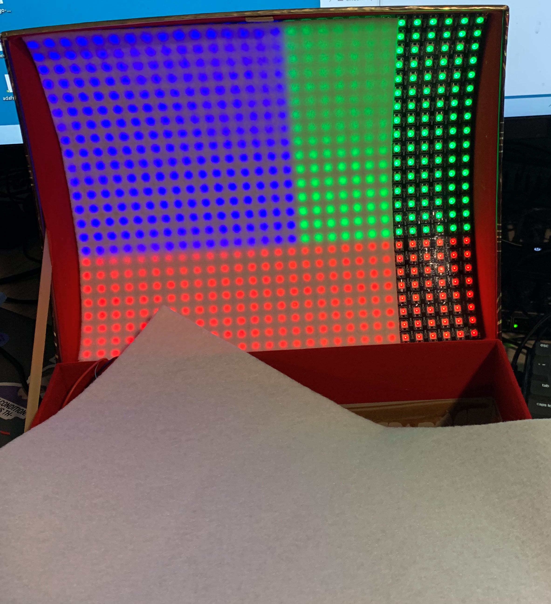
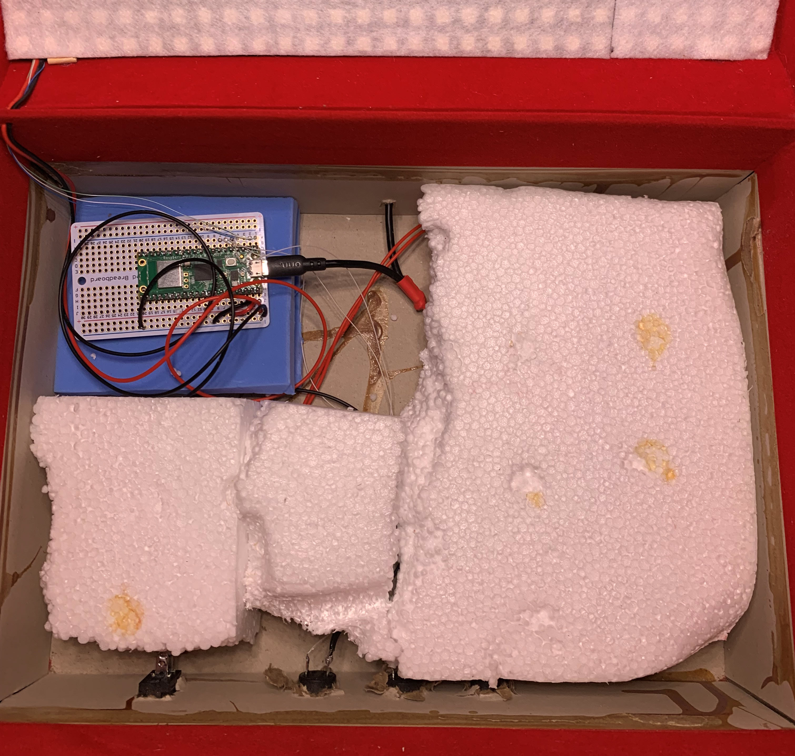
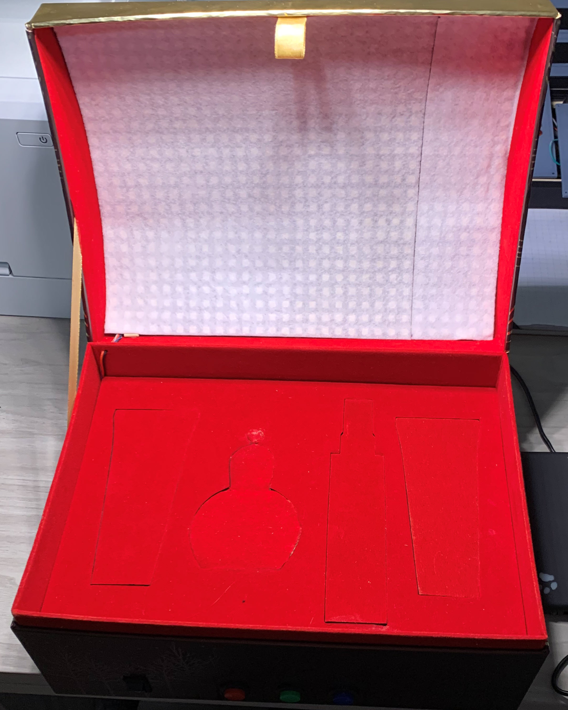

This is one sturdy box! I am amazed at how rugged it is. I pulled the foam tray and found
crumbly styrofoam padding beneath it. It was partially glued to the box, but it was easy
to pull out.

I picked up three neopixel panels. The inside of the lid is perfectly 16+8 pixels tall. But
the lid is only 29 pixels wide -- not the 32 I have. I carefully cut three columns off the
end of the flexible panels. 

I added a power switch and three buttons for inputs. Inputs for what? I have no idea yet. I
printed a template in Word to get the buttons and switch aligned on the front of the chest.

I used packing tape on the back of the panels to join them together. I used a soldering iron 
and packing tape to secure the power wires on the back of the panel. I added three large 
capacitors to the input power of the strips. I added a 360 ohm resistor to the input lines of 
the three panels. All the wires exit the bottom right of the picture.

I tested the individual panels before installing them.

I mounted the panel to the lid. The springy panel holds itself in surprisingly well, but I added small wooden
dowels in the corners to secure it. Thus, the panel is removable for repairs.

Neopixels need diffusion to soften their brightness. I had some white stick-on sheets from other 
projects. I carefully cut the sheets to size, peeled the backing, and stuck them right on the panels.

I mounted the raspberry pi pico in the box and wired everything up. See the simple schematics for
wiring details.

Here is the final project.

